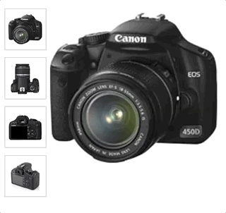
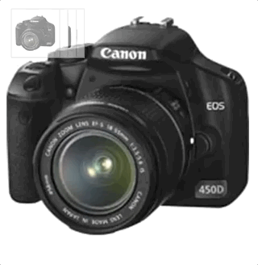

# Custom Styles

## Vertical thumb panel

The folowing snippets demonstrates the so-called amazon layout of thumbs. It's a small customisation that renders the thumbnails on the left hand side of the main image.

```
cx-product-images {
  --cx-flex-direction: row-reverse;
  justify-content: flex-end;

  .thumbs {
    flex-direction: column;
  }
}
```

**Demo**



## Staggered thumbnails

The PDP images can take quite some space. This example demonstrates staggered images, placed on top of the main image. Whenever the user navigates to the thumbnails, the stagered images animate to use the original space.

```
// sass variable
$size: 6vmax;

cx-product-images {
  .thumbs {
    position: absolute;

    cx-picture {
      transition: all var(--cx-transition-time);

      background: #fff;

      --cx-width: #{$size};
      --cx-height: calc(0.9 * #{$size});

      position: absolute !important;

      @for $i from 1 through 10 {
        &:nth-child(#{$i}) {
          z-index: #{10 - $i};
          left: #{($i - 1) * 1vw};
        }
      }
      &.active {
        --cx-border-color: var(--cx-light);
      }
    }

    &:hover {
      cx-picture {
        @for $i from 1 through 10 {
          &:nth-child(#{$i}) {
            left: #{($i - 1) * $size};
          }
        }

        &.active {
          --cx-border-color: var(--cx-primary);
        }
      }
    }
  }
}
```

An additional effect can be used to make the images transparent initially,
and make them fully visible on hover.

```
cx-product-images {
  // make thumb section transparent initially
  .thumbs {
    opacity: 0.5;
    transition: all var(--cx-transition-time);
  }
  &:hover {
    .thumbs {
      // remove transparency on hover
      opacity: 1;
    }
  }
}
```

**Demo staggered thumbnails**


